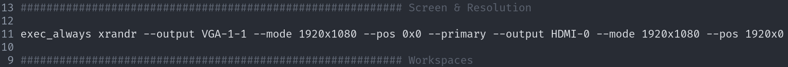

# Installation

[//]: # (Explains the installation process of i3buntu)
[//]: # (version 1.0.1)

## Runlevel 0 - Acquiring an ISO

To get things started, you will need an [Ubuntu ISO image](https://ubuntu.com/download). As of now, the latest LTS (Long Term Support) version of Ubuntu is 20.04. The installation of these is straightforward. **We recommend using the server version** as it ships without unnecessary packages. These images also support [UEFI](https://wiki.archlinux.org/index.php/Unified_Extensible_Firmware_Interface) right out of the box.

## Runlevel 3 - Managing packages

If you chose the desktop version, you can remove GNOME packages and reboot. This is, however, not an absolute must, as some might prefer to have an alternative to _i3-gaps_. From hereon, update the system. Afterwards, download a release of _i3buntu_ onto your system. You will need to extract  it, and, if you like, you can rename it. The following commands accomplish just that.

``` BASH
# (Optional) Remove GNOME
sudo apt-get purge gnome-desktop*

# Update the system
sudo apt-get -y update && sudo apt-get -y dist-upgrade

# Download the latest stable release
cd && wget https://github.com/aendeavor/i3buntu/archive/v1.0.13-stable.tar.gz

# Decompress the .tar.gz
tar xvfz v1.0.13-stable.tar.gz && rm v1.0.13-stable.tar.gz

# Rename the directory
mv i3buntu* i3buntu
```

You can now start the installation of _i3buntu_. Execute [`install.sh`](./install.sh) and provide the necessary parameters and options. You can execute `./install.sh --help` to see the detailed usage. For server installations, this step will finish the installation. For desktops, you will need to start configuration separately.

``` BASH
# For desktop installations, you will need
# to execute the packaging and configuration separately
cd && ./i3buntu/install.sh desktop --pkg

# For server installations, run
cd && ./i3buntu/install.sh server
```

## Runlevel 5 - Configuration

On desktops, you should be greeted on a graphical interface after a reboot. During login, i3 will ask you whether you would like to create an i3 config file, which you will answer with yes. For your _mod key_, choose the _Super_ key.

You will now need to create the fitting _xrender_ settings so your screens are displayed the way they should. Open `arandr`, either by command line or through rofi, which is invoked with _mod + d_. `arandr` will assist you with the setup of multiple monitors. When you are done, save these setting in a file of your choice, open this file and copy the content. Next, open i3's `config`-file in this repository

``` BASH
cd ~/i3buntu && vi ./resources/sys/Xi3/config
```

and paste your setup in these lines after `exec_always xrander`



Afterwards, save the file and run your configuration script. The server-installation does this automatically, so you will not need to do this yourself if you install _i3buntu_ as a server. This is how you invoke configuration:

``` BASH
# For desktop installations, you will need
# to execute the packaging and configuration separately
cd && ./i3buntu/install.sh desktop --cfg
```

## Runlevel ∞ - Tweaks

That's it. You may need to tweak a few things to your liking. These are:

* use _LXappearance_ to mod your color theme (Adapta Blue Nokto Eta) and your icon theme (Tela Black Dark) - open rofi with _$mod + d_ and start typing the name of the desired application
* `config` under `~/.config/i3/` - You may need to change pactl keybindings (ll. 16-17)
* install a graphics driver if necessary
