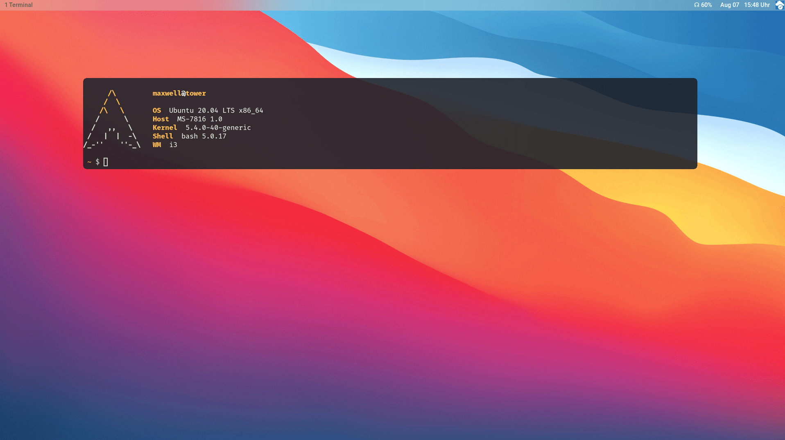
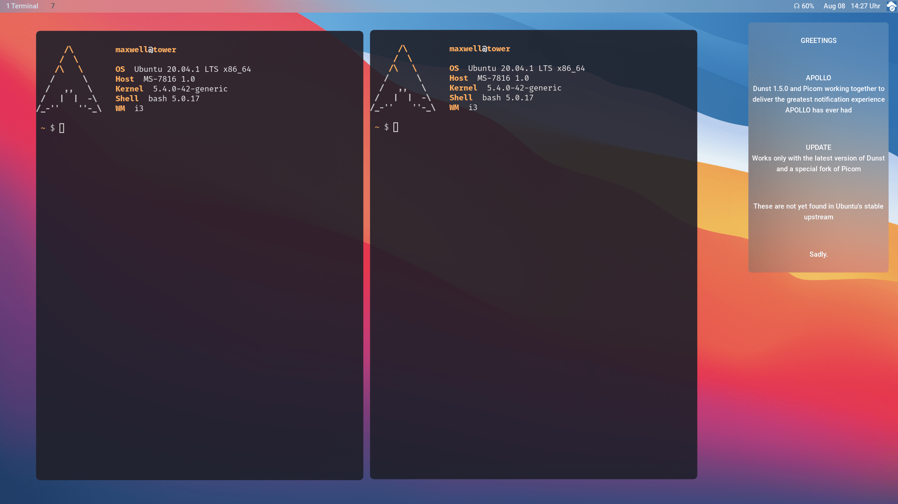
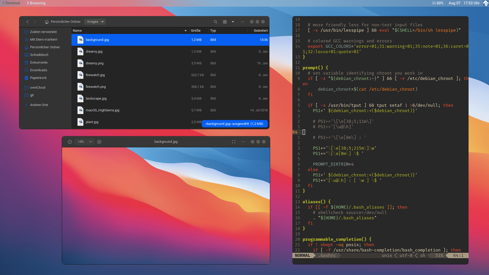
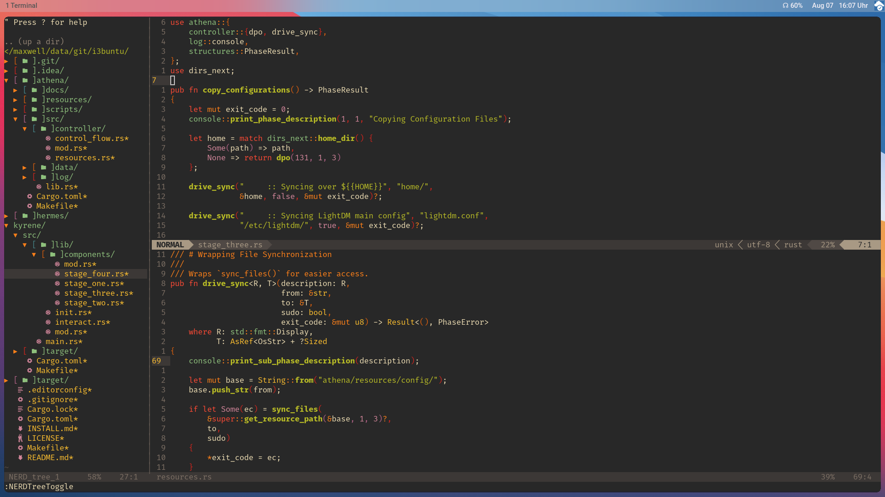

<h1 align="center" >
  <i>i3buntu</i>
</h1>

    
    
    
    

#

<h2 align="center" >
  Introduction & Installation Instructions
</h2>

  <b><i>i3buntu</i></b>  provides means to customize an <a href="https://ubuntu.com/"><i>Ubuntu</i></a> installation by deploying needed programs and sensible default settings. We are enabling everyone to install <a href="https://github.com/Airblader/i3"><i>i3-gaps</i></a> and other basic software with a single, easy bootstrapping process.  
  Everything you need to know about the <b>installation process</b> can be found in <a href="INSTALL.md"><code>INSTALL.md</code></a>.

<h3 align="center" >
  Licensing
</h3>

  This project is licensed under the <a href="./LICENSE"><i>GNU Lesser General Public License</i></a> version 3.

