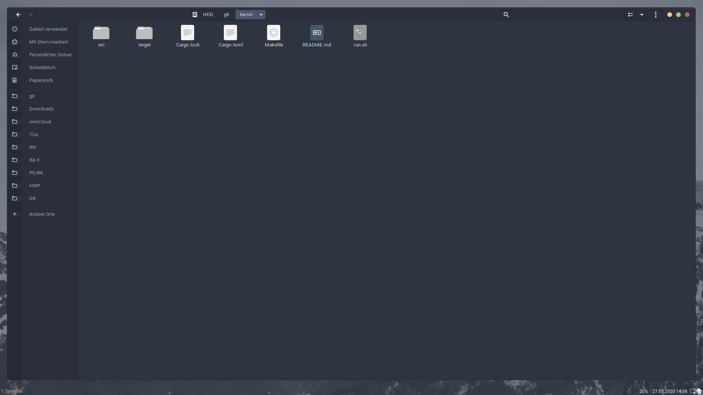

# 

## APOLLO

 

[//]: # (Main README in /)
[//]: # (version 0.1.0)

This repository provides means to customize an [_Ubuntu_](https://ubuntu.com/) installation. As an advancement of _i3buntu_, which was the name of this project's predecessor, this project is all about the ease of bootstrapping settings and programs.

### Installation Instructions

Are found in [`INSTALL.md`](INSTALL.md).

### About

As mentioned, this project advances _i3buntu_. With _Regolith Linux_, a more seamless integration of [_GNOME_](https://www.gnome.org/) and [_i3-gaps_](https://github.com/Airblader/i3) is offered, which in turn makes for a simpler post-configuration. As GNOME is a desktop environment, it features all the settings you are used to when using regular [_Ubuntu_](https://ubuntu.com/), but now enhanced with _i3-gaps_, a tiling window manager.

### Submodules

#### _Kyrene_

This submodule does the actual work and processes all request and tasks. The program is written entirely in RUST and automatically invoked during installation. _Kyrene_ places all configuration files and installs the necessary software for you.

#### _Athena_

_Athena_ holds all configuration files and instructions which software to install. This is heavily used by _Kyrene_. Moreover, all icons, logos and images are stored there as well.

#### _Hermes_

Is there for you convenience and provides a simple forwarding mechanism via [apollo.itbsd.com](apollo.itbsd.com) to get the `init.sh` script. This script is executed before all the rest - it bootstraps this repository.

### Warranty, Licensing & Credits

This project is licensed under the [_GNU Lesser General Public License_](LICENSE), version 3, 29 June 2007. For warranty and icon-, font- or logo-credits, see [Credits and Warranty](athena/docs/cw.md).
