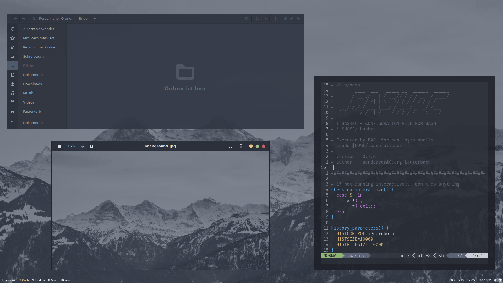
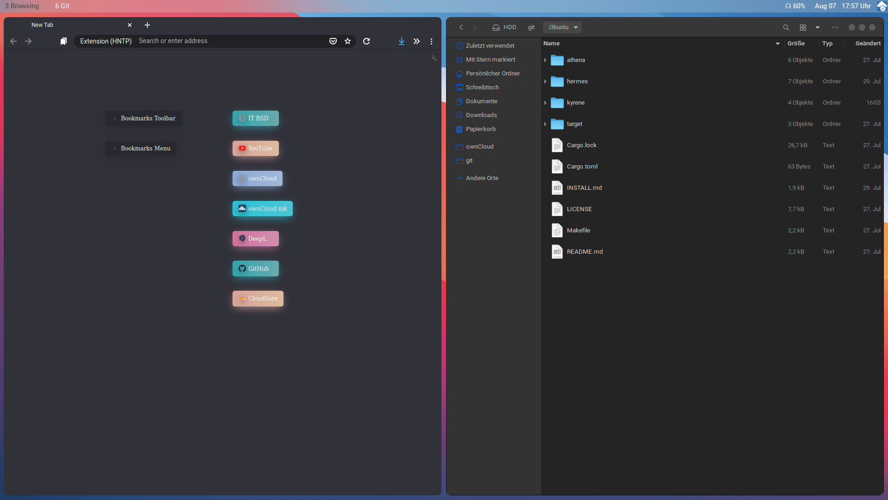
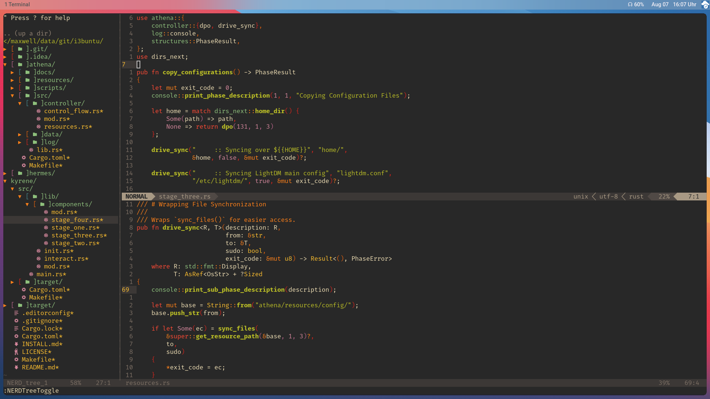

# 

## APOLLO

    

[//]: # (Main README in /)
[//]: # (version 0.2.0)

This repository provides means to customize an [_Ubuntu_](https://ubuntu.com/) installation by deploying the needed programs and sensible default settings.

### Installation Instructions

Are found in [`INSTALL.md`](INSTALL.md).

### About

This project advances _i3buntu_, which had been this project's name. We are trying to provide everyone with a single easy bootstrapping process for the installation of [_i3-gaps_](https://github.com/Airblader/i3) and other basic software.

#### Submodules

##### _Kyrene_

_Kyrene_ holds the binary which does the actaul job at runtime. Like all other projects in this repository, it is written in [_Rust_](https://www.rust-lang.org/). _Kyrene_ depeneds on _Athena_.

##### _Athena_

_Athena_ provides the base library _Kyrene_ uses. Moreover, all configuration files and software module descriptions are held here, as well as icons, logos and images.

##### _Hermes_

Is there for you convenience and provides a simple forwarding mechanism via [apollo.itbsd.com](https://apollo.itbsd.com) to get `init.sh`. This script is executed before the rest, bootstraping this repository itself.

### Warranty, Licensing & Credits

This project is licensed under the [_GNU Lesser General Public License_](LICENSE), version 3, 29 June 2007. For warranty and icon-, font- or logo-credits, see [Credits and Warranty](athena/docs/cws.md).
