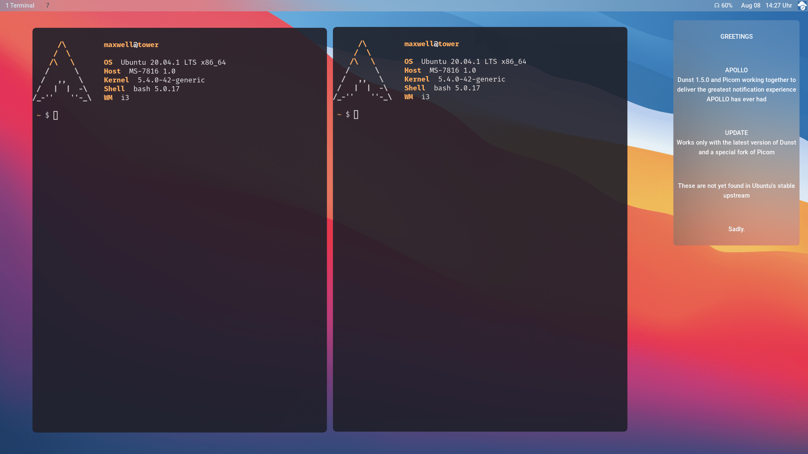

# 

## APOLLO

    

[//]: # (Main README in /)
[//]: # (version 0.2.2)

i3buntu provides means to customize an [_Ubuntu_](https://ubuntu.com/) installation by deploying the needed programs and sensible default settings.

### Installation Instructions

Are found in [`INSTALL.md`](INSTALL.md).

### About

The ***APOLLO*** project advances _i3buntu_. We are trying to provide everyone with a single easy bootstrapping process for the installation of [_i3-gaps_](https://github.com/Airblader/i3) and other basic software.

#### Submodules

##### _Kyrene_

_Kyrene_ holds the binary which does the actual job at runtime. Like all other projects in this repository, it is written in [_Rust_](https://www.rust-lang.org/).

##### _Athena_

_Athena_ provides the base library _Kyrene_ uses. Moreover, all configuration files and software module descriptions are held here, as well as icons, logos and images.

##### _Hermes_

_Hermes_ provides a forwarding mechanism via [apollo.itbsd.com](https://apollo.itbsd.com) to download and execute `init.sh`. This script acquires the latest stable release candidate and starts ***APOLLO***.

### Warranty, Licensing & Credits

This project is licensed under the [_GNU Lesser General Public License_](LICENSE), version 3, 29 June 2007. For warranty and icon-, font- or logo-credits, see [Credits and Warranty](athena/docs/cws.md).
