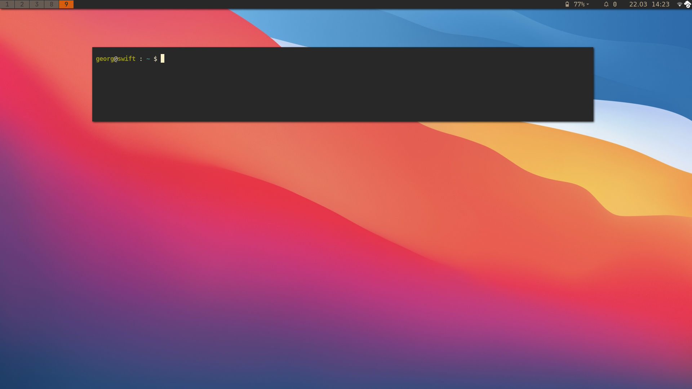
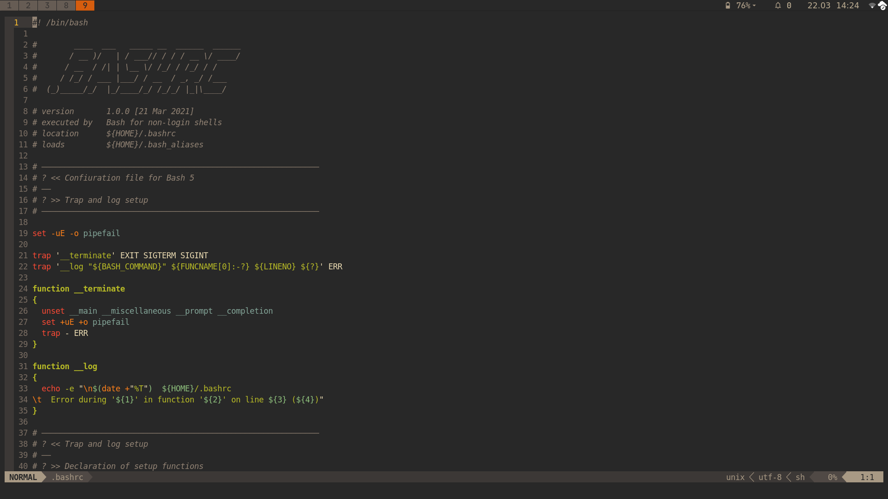

<h1 align="center" >
  <i>i3buntu</i>
</h1>

<p align="center">
    
    
    <br/>
</p>

<h3 align="center" >
  Introduction
</h3>

<p align="center">
  <b><i>i3buntu</i></b> provides means to customize an <a href="https://ubuntu.com/"><i>Ubuntu</i></a> installation by deploying needed programs and sensible default settings. With version 4, we build upon <a href="https://regolith-linux.org/">Regolith Linux</a>. Because of this, the setup has been simplified.
</p>




<h3 align="center">
  Installation Instructions
</h3>

``` BASH
wget https://raw.githubusercontent.com/aendeavor/i3buntu/master/scripts/setup.sh
sudo -E bash setup.sh
reboot

regolith-look set gruvbox
regolith-look refresh
```

<h3 align="center" >
  Licensing
</h3>

<p align="center">
  This project is licensed under the <a href="./LICENSE"><i>GNU Lesser General Public License</i></a> version 3.
</p>
