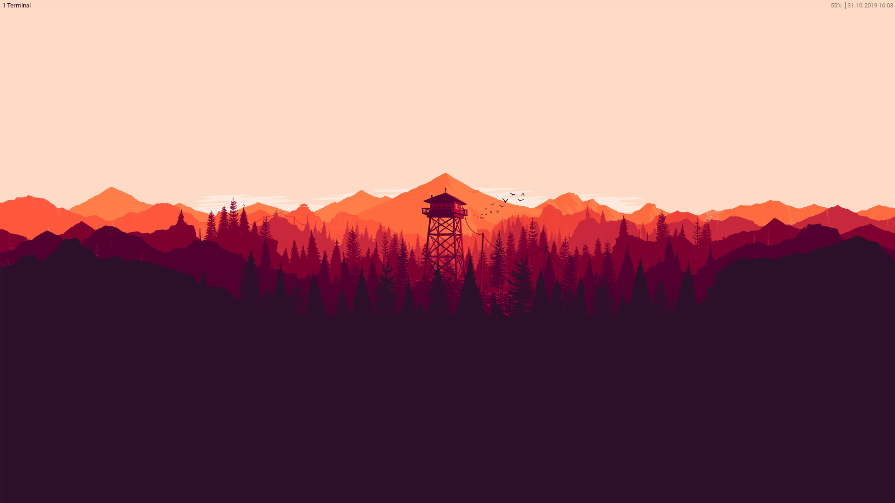

# Ubuntu Minimal & i3

## Preamble

This repository aims at providing you with a set of instructions to create your own minimal Ubuntu installation with the i3 window manager. This will enable you to not only work more efficiently with your system, but also in a much more beautiful environment.

## Prerequisites

### Why Ubuntu

The following instructions are made for [Ubuntu](https://wiki.archlinux.org/index.php/Arch_compared_to_other_distributions#Ubuntu) / [Debian](https://wiki.archlinux.org/index.php/Arch_compared_to_other_distributions#General) based systems and are not compatible with other operating systems. Ubuntu has been chosen to provide every person with ease of use and stability. Although [Arch Linux](https://wiki.archlinux.org/index.php/Arch_Linux) is just more powerful when it comes to customizability, it is also more difficult to setup, and far easier to accidentally destroy.

**Systems not based on Ubuntu, including but not limited to those using package-managers differing from APT or not supporting Snap, are not officially supported by this guide.**

### Knowledge

It is *highly recomended* to be familier with the linux environment and command line. Absolute beginners might start off with a simple Ubuntu installation and become comfortable first, before approaching this.

### Dependencies

This guide relies on using the following sources.

* [Ubuntu 18.04 LTS](http://releases.ubuntu.com/18.04/) Operating System
* [URXVT](https://wiki.archlinux.org/index.php/Rxvt-unicode) Terminal Emulator
* [Aptitude](https://wiki.debian.org/Aptitude) (APT) Packaging Manager
* [Snap](https://wiki.archlinux.org/index.php/Snap) Package Management
* [i3](https://wiki.archlinux.org/index.php/I3) Tiling Window Manager
* [Xorg](https://wiki.archlinux.org/index.php/Xorg) (X) Display server
* [LightDM](https://wiki.archlinux.org/index.php/LightDM) Display Manager
* [Nemo](https://wiki.archlinux.org/index.php/Nemo) File Manager

### Improvements

#### Desktop Environment and Color Scheme

The i3 window manager together with the X display server drive your Ubuntu desktop. There is no bloatware or unneccessary waste of screen-space.

The color scheme has been carefully picked and almost all components that can be configured have adapted this theme. Through the use of applications like URXVT and i3, customizability is no problem. If you are not satisfied with colors, change them on your own.

#### Terminal

On first sight, you will realize the prompt / PS1 has changed. It has become clearer and more lightweight. Bash now provides you with many more tools and aliases. The file [`bash_aliases`](resources/bash/.bash_aliases) contains aliases and exported functions. Make youself familiar with them.

#### Performance and Efficiency

i3 and X are much more lightweight compared to GNOME or KDE. As a result, everything is faster. Through the use of a tiling window manager working with your computer feels easier, as the is no drag-n-drop, pre-defined workspaces and less use of your mouse.

## Warranty

This guide and these files come with absolutely **no warranty**! The knowledge is provided "as is", without warranty of any kind, express or implied, including but not limited to the warranties of unleashing indescribable horrors.

## Installation instructions

Installation instructions are found [here](./INSTALL.md). You will need to get an ISO file first, install the base system, clone this repository, execute the packaging script, reboot, execute the configuration script, reboot, manually tweak the desktop - and you are done.

The `configuration.sh` script is currently in testing and may behave incorrectly (*14th Oct. 2019*).
